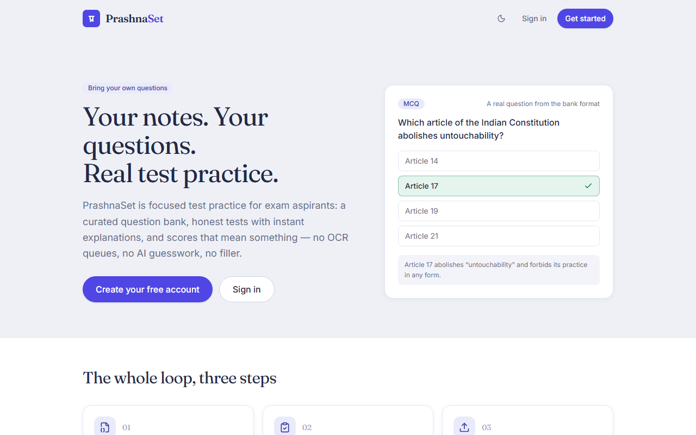
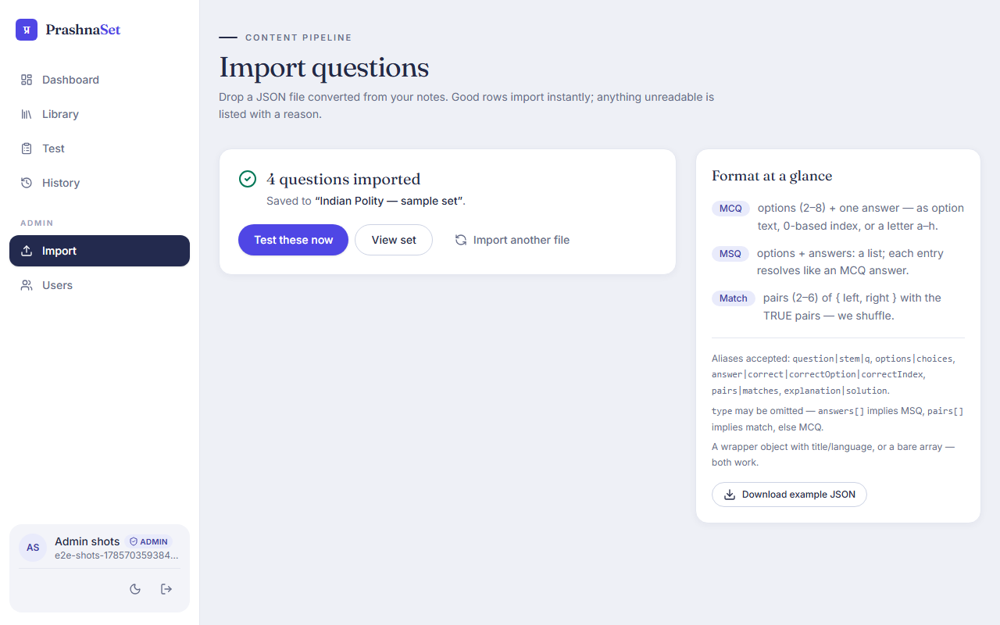
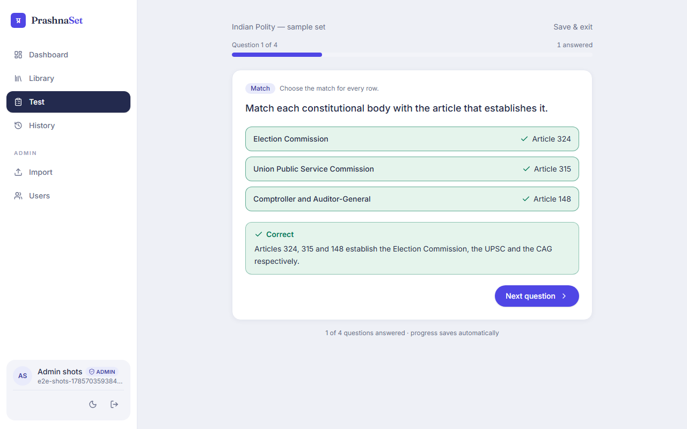
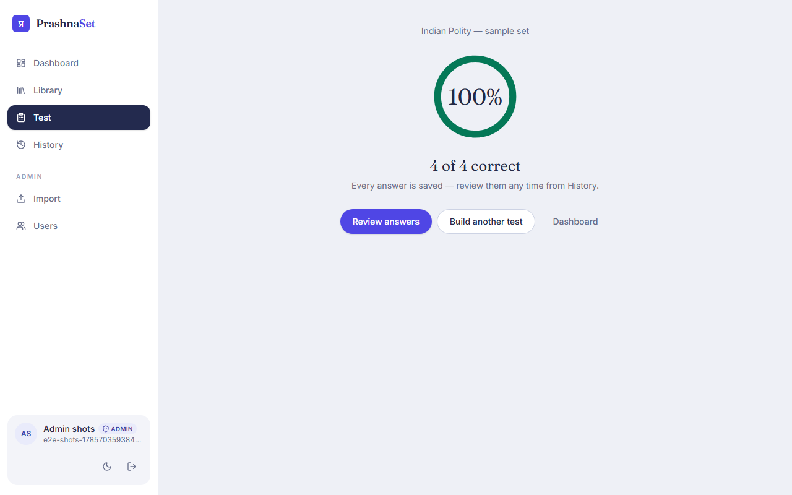
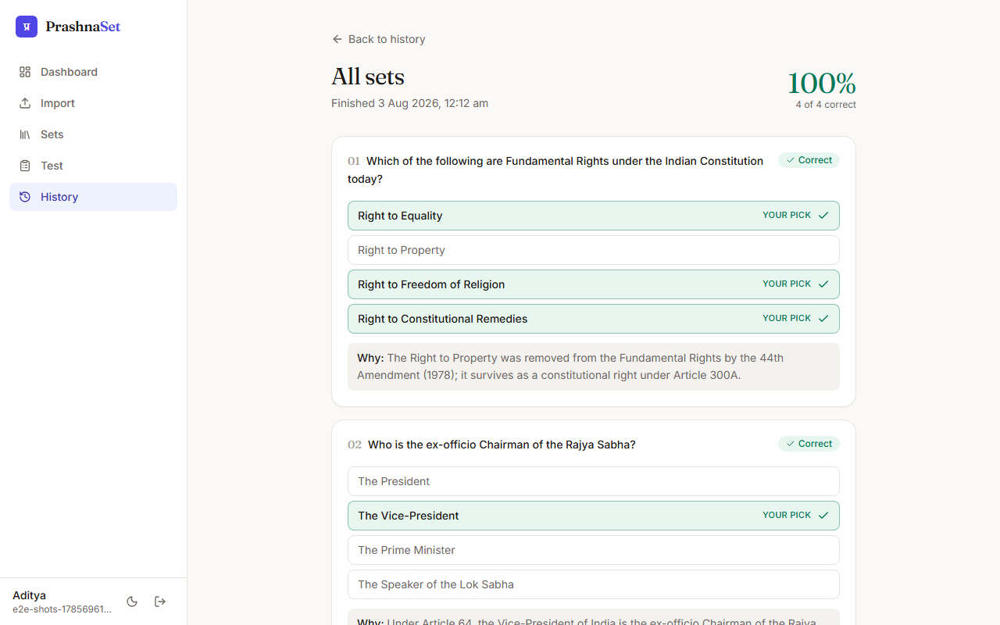
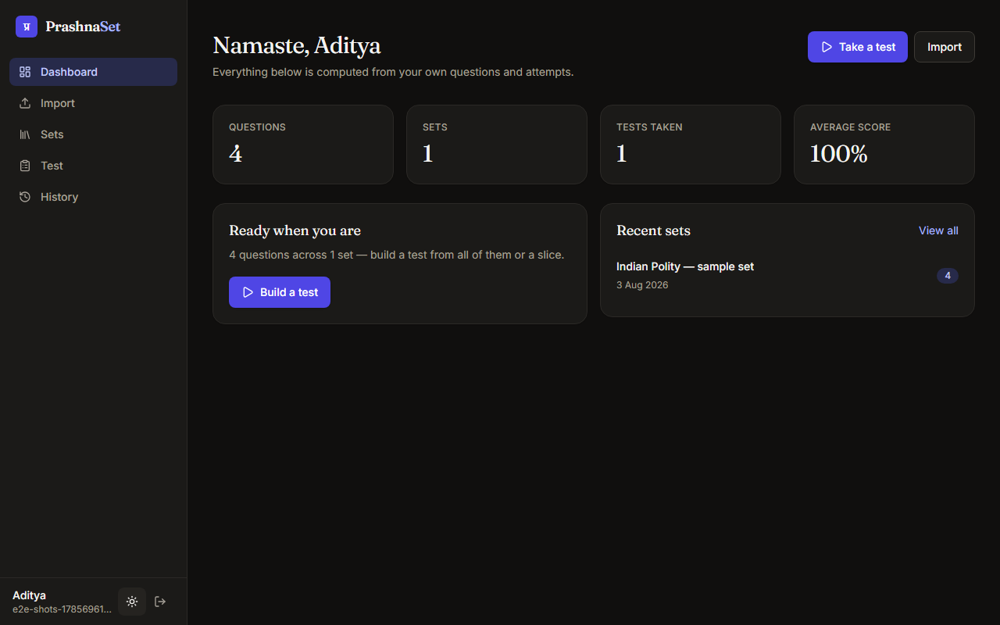

# PrashnaSet — प्रश्न set

A focused question-bank and test app for exam aspirants. Bring your own
questions as a JSON file (converted from your PDFs/notes with any tool you
like), import them in one drop, and take tests on them tonight — scores,
history, explanations. **The entire v1 is one feature done excellently.**
No OCR, no AI generation, no background pipeline.

**The core loop:** convert notes → drop JSON → questions ready → take a test
tonight → see the score → retake weak ones.

| | |
| --- | --- |
|  |  |
|  |  |
|  |  |

*(Screenshots are captured from the real app by `e2e/screenshots.spec.ts` —
nothing mocked.)*

## Stack

| Layer | Choice |
| --- | --- |
| Framework | Next.js 16 (App Router, Turbopack) + TypeScript |
| Database | Supabase Postgres, **Row-Level Security on every table** |
| Auth | Supabase Auth (email/password) |
| Styling | Tailwind CSS v4 — custom token system, light + dark |
| Validation | Zod (import file **and** every API/action payload) |
| Tests | Vitest (unit) + Playwright (e2e against a real DB) |
| Hosting | Vercel + Supabase Cloud |

There is deliberately **no service-role key anywhere** in the app: every
query runs as the signed-in user, and Postgres RLS is the enforcement
layer. `e2e/rls.spec.ts` proves at the database level that one user cannot
read, modify or forge another user's rows.

## Import format

The forgiving parser accepts MCQ, MSQ and match-the-following questions
with field aliases, index/letter answers and per-row error reasons — good
rows always land, bad rows are listed with why. Full spec:
[`docs/question-import-format.md`](docs/question-import-format.md) ·
working example: [`public/question-import-example.json`](public/question-import-example.json).

## Local development

Prerequisites: Node 20.9+, Docker Desktop (for local Supabase).

```bash
npm install
npx supabase start        # local stack on ports 56321 (API) / 56323 (Studio)
npm run dev               # http://localhost:3000
```

`.env.local` is pre-wired to the local stack (regenerate values with
`npx supabase status -o env`). Auth emails (password reset) land in Mailpit
at `http://127.0.0.1:56334`. Local ports live in `supabase/config.toml`
(56320–56334 block, chosen to avoid other local Supabase projects).

## Tests and gates

```bash
npm run test        # Vitest — parser, grading, match-shuffle transform
npm run typecheck   # tsc --noEmit
npm run lint        # eslint
npm run build       # next build
npm run gate        # all four, in order — must be green before every commit
```

End-to-end (needs the local Supabase stack running and a fresh
`npm run build`):

```bash
npm run e2e         # signup → import → sets → test run → resume → score → review
                    # + skipped-rows acceptance + cross-user RLS proof
                    # every UI spec asserts zero browser console errors
```

## Deploying

1. **Supabase Cloud** — create a project, then apply the schema:
   - Preferred: `npx supabase link --project-ref <ref>` and
     `npx supabase db push` (uses `supabase/migrations/`).
   - No CLI login handy: paste [`supabase/cloud-setup.sql`](supabase/cloud-setup.sql)
     into Dashboard → SQL Editor → Run (fresh projects only).
2. **Vercel** — import the repo and set two environment variables:
   `NEXT_PUBLIC_SUPABASE_URL` and `NEXT_PUBLIC_SUPABASE_PUBLISHABLE_KEY`
   (Supabase → Project Settings → API keys; the legacy anon key also works
   via `NEXT_PUBLIC_SUPABASE_ANON_KEY`).
3. In Supabase → Authentication → URL Configuration, set the site URL to
   your Vercel domain and add `https://<your-domain>/auth/callback` to the
   redirect list (password-reset links go through it).

## Data model

`profiles` → `folders` (optional grouping; deleting one leaves its sets
Unfiled) → `question_sets` → `questions` (soft-removable, `position`-ordered)
plus `test_sessions` → `session_questions` (ordered membership) → `attempts`
(one per question per session, server-graded). Sets can be imported straight
into a folder and moved between folders at any time. Match questions store
`options.right` as a **code-side shuffle** of the correct mapping — the
file's ordering is never trusted. See
[`supabase/migrations/`](supabase/migrations) for the full schema, RLS
policies and grants.

## Out of v1 (deliberate)

AI question generation from PDFs/photos, spaced repetition, folders and
subject taxonomy, PWA/offline, payments. The product spec that drove this
build is in [`PRD.md`](PRD.md).
